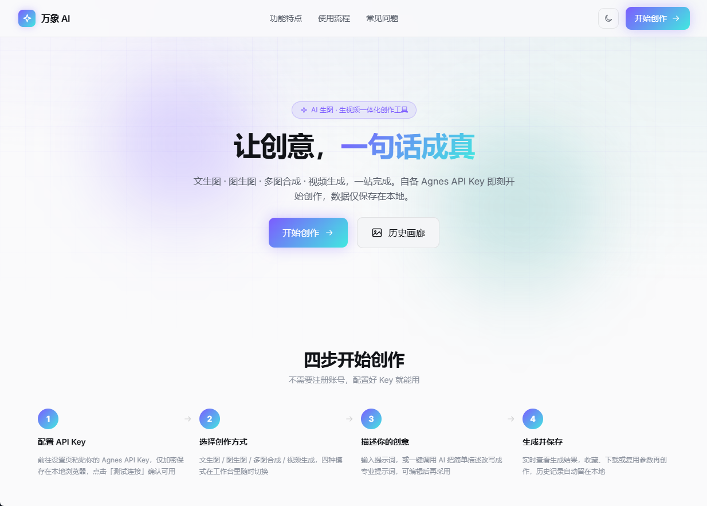
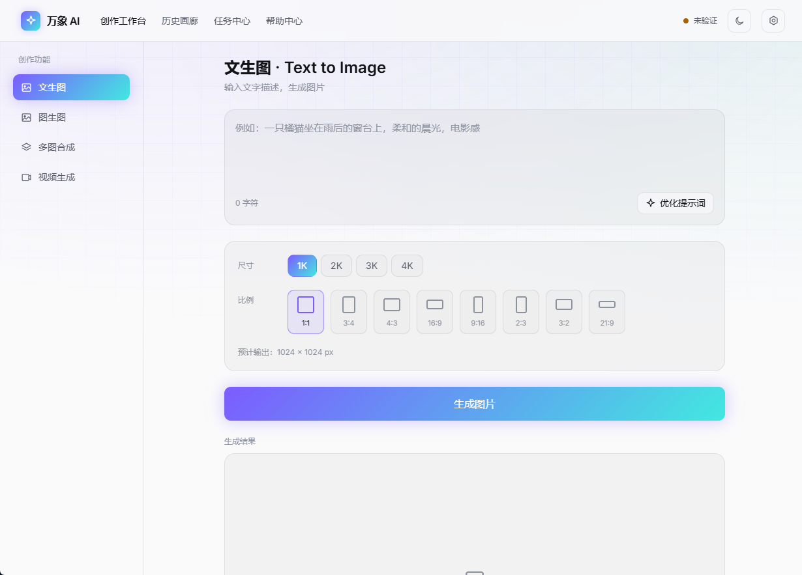
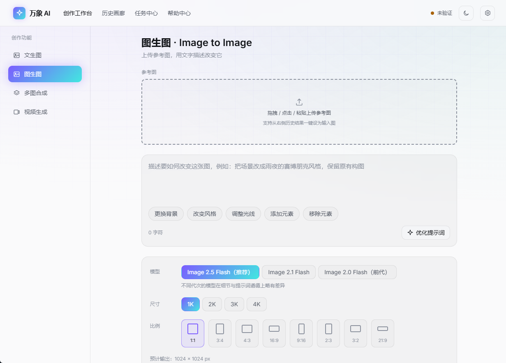
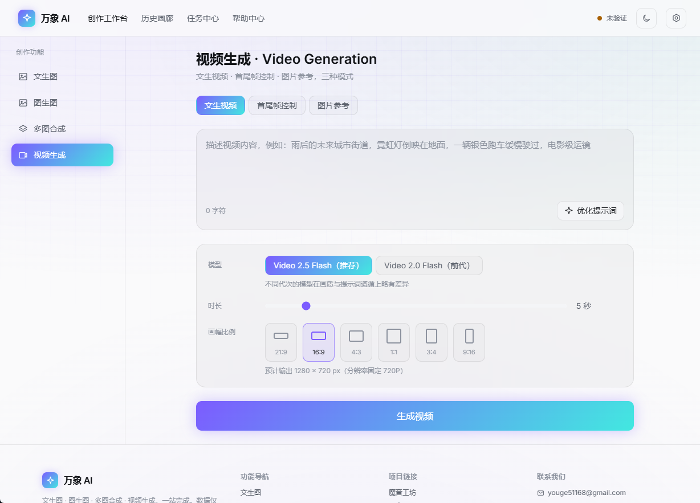

# 万象 AI

在线 AI 生图 / 生视频工具站：文生图、图生图、多图合成、视频生成（文生视频 / 首尾帧控制 / 图片参考），并内置基于文本模型的提示词优化。纯前端、无管理后台，用户自备 [Agnes AI](https://www.agnes-ai.cn/zh-Hans/docs/overview) API Key（BYOK），密钥与生成历史仅保存在浏览器本地。

## 功能特性

- **四种创作模式**：文生图 / 图生图 / 多图合成 / 视频生成（文生视频、首尾帧控制、图片参考）
- **模型可选**：
  - 图生图支持 `agnes-image-2.0 / 2.1 / 2.5-flash` 三代图像模型切换
  - 视频生成支持 `agnes-video-2.0 / 2.5-flash` 两代视频模型切换
  - 设置中心可选默认文本模型（`agnes-2.5 / 3.0-flash`），作用于提示词优化与测试连接
- **多 API Key 轮询容灾**：支持配置多个 API Key，生成任务自动轮询分摊；某个 Key 连接超时、无效或额度异常时自动切换到下一个 Key（带故障冷却与 Toast 提示），不中断当前任务
- **提示词优化**：文本模型流式改写提示词，打字机效果、可随时停止、Thinking 模式可选
- **任务中心**：视频异步任务后台轮询、持久化到本地，刷新/关页不丢失，失败可一键重试
- **历史画廊**：本地 IndexedDB 存储，支持公开画廊云同步（可选，基于 Supabase）
- **体验细节**：明暗双主题、科技感网格背景与光斑动效、浏览器图标（favicon）、页脚功能导航 / 项目链接 / 联系方式、返回顶部按钮

## 界面预览

| 首页 | 文生图 |
|---|---|
|  |  |
| **图生图** | **视频生成** |
|  |  |

## 目录结构

| 目录 | 内容 |
|---|---|
| [`docs/`](docs) | 需求文档、网页设计文档、Agnes API 接口文档（整理版，含新一代模型） |
| [`screenshots/`](screenshots) | 界面截图（首页 / 文生图 / 图生图 / 视频生成） |
| [`webapp/`](webapp) | 可直接部署到 Cloudflare Pages / Vercel / Netlify 的完整前端源码 |

## 从这里开始

- 想了解产品定位、功能范围、非功能需求 → 看 [docs/需求文档.md](docs/需求文档.md)
- 想了解视觉设计、页面布局、技术架构决策 → 看 [docs/网页设计文档.md](docs/网页设计文档.md)
- 想了解 Agnes 各模型的具体接口参数 → 看 [docs/API接口文档.md](docs/API接口文档.md)
- 想跑起来看效果、部署上线、扩展新的模型服务商 → 看 [webapp/README.md](webapp/README.md)

## 快速启动

```bash
cd webapp
npm install
npm run dev
```

打开后前往「设置中心」填入 Agnes API Key（可添加多个备用 Key 参与轮询）即可开始创作。完整部署教程（含推送到 GitHub、Cloudflare Pages / Vercel / Netlify 三平台详细步骤、常见问题排查）见 [webapp/README.md](webapp/README.md#部署到托管平台详细教程)。

## 项目状态

网站全部核心功能（四种创作模式、模型选择、多 Key 轮询容灾、提示词优化、历史画廊、任务中心、设置中心）已实现并用真实 API Key 完整联调验证通过，可直接部署使用。设计阶段产出的需求/设计文档作为过程资料保留在 `docs/`，供后续迭代参考。
